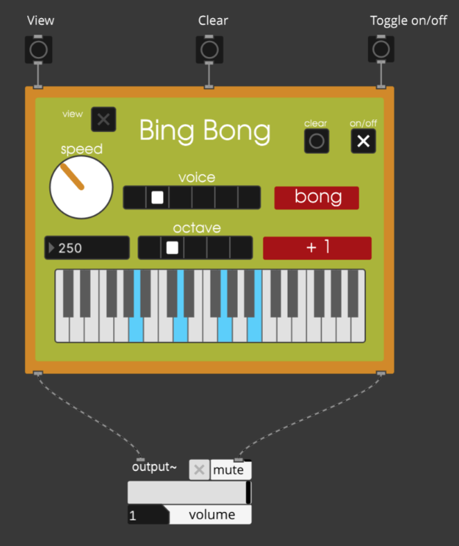

# What is it?
Bing Bong is a custom modular sequencer written designed in PlugData. It was inspired by the game PEAK although it bares no relevance to its namesake.
# How to use it?
However you want. Feel free to modify it to do whatever you want, I would love to see how you use this.

As a simple introduction, you can set notes manually via the keyboard or hit the "view" button to open the window of notes that the sequencer is using. The clear button clears the notes. Speed controls note speed, octave controls the octave, etc. The two voices are `bing` which has 100 ms note duration, and `bong` which has a note duration relative to the current speed, think legato.

# Why did you make it?
Because I can

